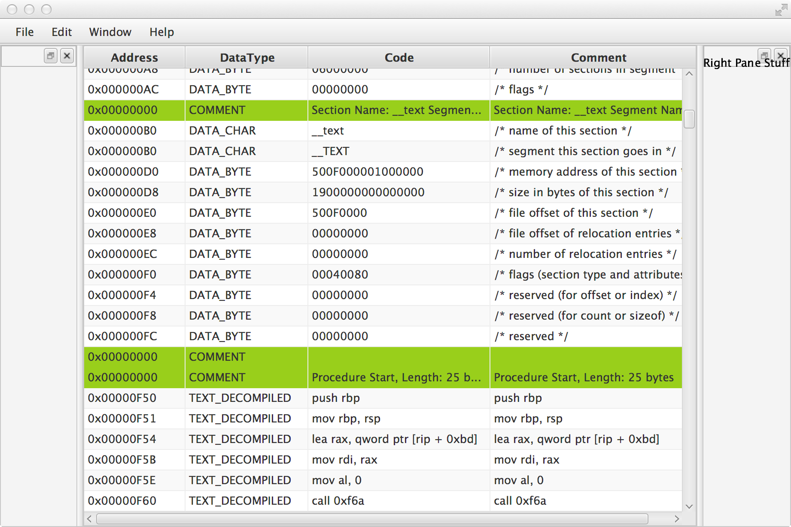

# Disassemble
A binary disassembler written in Java with Capstone bindings  

MachO 64bit ABI support is in the works. Future plans will include ELF and PE ABIs. Disassembling is made possible by the Capstone project and its Java bindings.

I eventually want to integrate lldb and make a fuzzer tool in this app.

Heres a screenshot of the working prototype. It is able to read and decompile basic Mach-O_64 binaries

